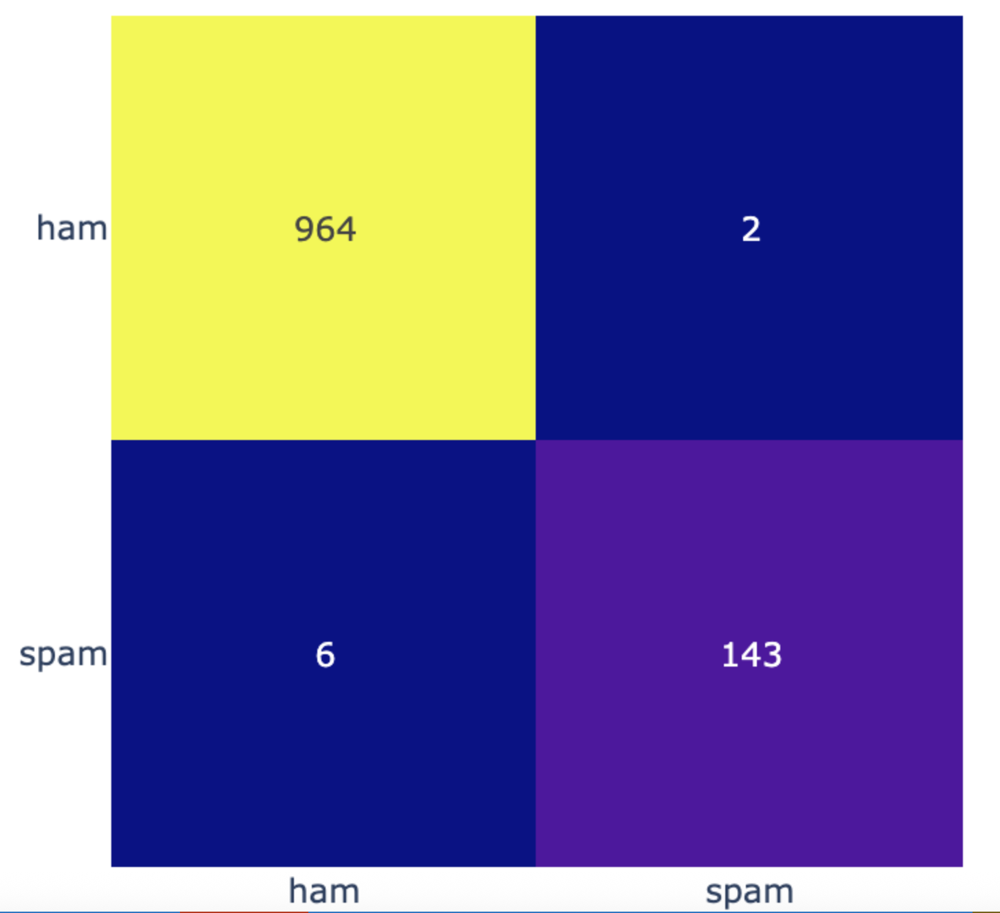

## Rapport sur le développement d'un détecteur de spam

L'objectif du détecteur de spam est de ne pas laisser passer de spam. En effet, les spams deviennent de plue en plus agressif et se transforme maintenant en action de Phishing pouvant compromettre dans le pire des cas des intégrités d'entreprise.  

Il est donc preferable d'avoir un sms de classé dans les spams même s'il est correct plutôt que laisser passer un spam comme un sms correct (HAM), le pouvoir destructeur d'un SPAM étant bien trop grave.

Au cours de cette étude, nous avons étudié 3 modèles de LLM pour résoudre le problème de l'identification de SPAM dans des SMS.
Tous s'appuient sur un modèle de langage robuste et éprouvé : BERT.  
Nous avons "fine-tuné" deux modèles ("bert-base-uncased" et "AventIQ-AI/bert-spam-detection" de la base Hugging Face) et utilisé directement sans le fine-tuné un modèle de la communauté Hugging Face déjà prêt à l'emploi pour les spam

Le modèle BERT, "fine-tuné" sur notre dataset donne un très bon résultats avec le Dataset d'étude.
AUC quasi parfait ()
La distinction entre Spam et Ham est quasiment parfaite.  
Sur le jeu de test en ne retenant que 64 tokens par message:

- 6 faux positifs seulement
- 2 faux négatifs
Les performances sont résumées ci-dessous.

|             | precision  |  recall |f1-score  | support |
|-------------|------------|---------|----------|-------|
|   HAM       |     0.99   |   1.00  |   1.00   |    966|
|   SPAM      |     0.99   |   0.96  |   0.97   |    149|
|    accuracy |            |         |   0.99   |   1115|
|   macro avg |     0.99   |   0.98  |   0.98   |   1115|
|weighted avg |     0.99   |   0.99  |   0.99   |   1115|

On a la matrice de confusion suivante :

Nous faisons ainsi mieux que le modèle de détecteur de SPAM sur 64 tokens "mrm8488/bert-tiny-finetuned-sms-spam-detection".  
Ce résultat tient principalement à la qualité du modèle BERT sous jacent utilisé pour notre "raffinement".

---

### Points forts

BERT, même s'il est généraliste, est un modèle entrainé par Google sur des quantités énorme de corpus de texte avec une infrastructure tout aussi énorme de traitement.

Il capte donc efficacement :

- Le **contexte global**
- La **structure syntaxique**
- Les **intentions lexicales**
- Les **variations orthographiques typiques du SPAM**

Il est particulièrement performant pour détecter des **signaux faibles**, même dans des SMS courts, où les indices sont parfois subtils.

---

### Limites identifiées

Vu l'efficacité du modèel de LLM  nous n'avons pas étudie de réseua récurrent de type LSTM qui naguère, étaient les plus performants. Il est reconnu qu'aujourd'hui qu'ils ne font plus le poids face au LLM principalement (grâce au concept d'attention).
Cependant, le Modèle est plus lourd qu’un LSTM → **temps d’inférence plus long**,  
plus exigeant en ressources, **GPU recommandé à grande échelle**

---

### Recommandations opérationnelles pour AT&T

Pour maximiser la chance d'intercepter des SPAM même au détriment de quelques HAM

- **Seuil plus bas** → priorité à la détection SPAM  
- **Seuil plus haut** → priorité à la réduction des faux positifs  

---
Il est important de réentrainer périodiquement (mensuellement ou trimestriellement) la base de SPAM pour que le modèle reste à la pointes des techniques émergentes de SPAM notamment pour les message de trype Phishing très destructeurs.

- Collecte des SMS mal classés  
- Enrichissement progressif du dataset interne  
- Ré-entraînement mensuel ou trimestriel  

---

### Conclusion

BERT tuné est notre choix pour obtenir une détection du SPAM d'excellente qualité.
